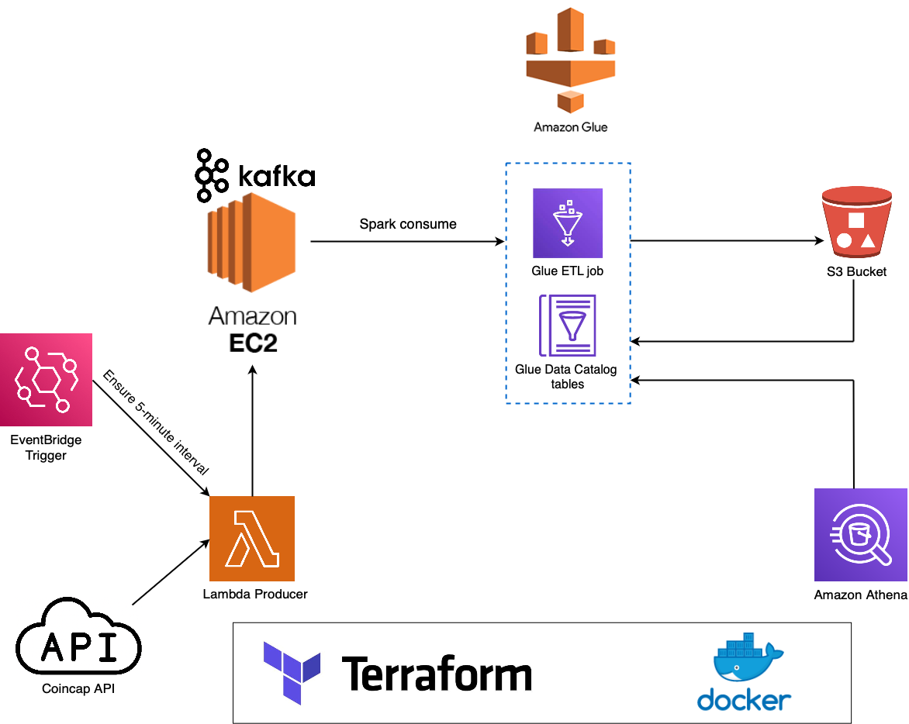

# Cryptocurrency

This is a serverless ETL pipeline to pull cryptocurrency market data [CoinCap API](https://docs.coincap.io/) from a Kafka broker server, apply preliminary transformations, and load it into data lakes

## Architecture

Provision an AWS EC2 instance acting as a Kafka broker server. A Lambda function to pull and load our data to the broker as a de-facto producer. Glue jobs then consume, transform and load our data from the Kafka topics to S3 buckets.

All of the components are provisioned through Terraform and Docker containers.